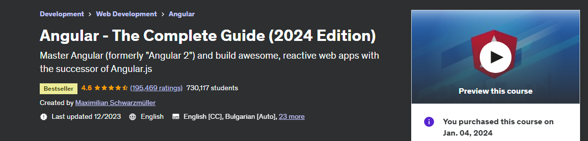

# Angular - The Complete Guide (2024 Edition)

Course: (https://www.udemy.com/course/the-complete-guide-to-angular-2/)  
Course length: <b>36 hours</b> 
Author: Maximilian Schwarzmüller 
 

Master Angular (formerly "Angular 2") and build awesome, reactive web apps with the successor of Angular.js.
 
### Life cycle of Course Outline:
| Section | Topics | Completed |
| ---: | --- | :---: |
| Section 01 | Getting Started | &check; |
| Section 02 | The Basics | &check; |  
| Section 03 | Course Project - The Basics | &check; |  
| Section 04 | Debugging |  |  
| Section 05 | Components & DataBinding Deep Dive |  |  
| Section 06 | Course Project - Components and DataBinding |  |  
| Section 07 | Directives |  |  
| Section 08 | Course Project - Directives |  |  
| Section 09 | Services & Dependency Injection |  | 
| Section 10 | Course Project - Services and Dependency Injection |  |  
| Section 11 | Changing Pages with Routing |  | 
| Section 12 | Course Project - Routing |  | 
| Section 13 | Observables |  | 
| Section 14 | Course Project - Observables |  |  
| Section 15 | Handling Forms |  |  
| Section 16 | Course Project - Forms |  |  
| Section 17 | Pipes to Tranform output |  |  
| Section 18 | Making Http Requests |  |  
| Section 19 | Course Project - Http |  |  
| Section 20 | Authentication and route protection |  |  
| Section 21 | Dynamic Components |  |  
| Section 22 | Modules & Optimizing Apps |  |  
| Section 23 | Deployment |  |  
| Section 24 | Standalone Components |  |  
| Section 25 | Angular Signals |  |  
| Section 26 | NgRx for State Management |  |  
| Section 27 | Angular Universal |  |  
| Section 28 | Angular Animation |  |  
| Section 29 | Offline Capabilities with ServiceWorkers |  |  
| Section 30 | Unit Testing |  |  
| Section 31 | Angular Platform and CLI |  |  
| Section 32 | Angular Changes and new Features |  |  